<div align="center">

<h3><code>hardik@github ~ $ ./contributions.sh</code></h3>


<br><br>

<h3><code>hardik@github ~ $ whoami</code></h3>


<br>

<code>hardik@github ~ $ ls ~/projects</code>

| Project | Description |
|---------|-------------|
| [api-runner](https://github.com/thehaardik/api-runner) | Postman-style bulk API runner — paste cURL, upload CSV/JSON, execute in batch |
| [key-certificate-matcher](https://github.com/thehaardik/key-certificate-matcher) | Match private keys with certificates for TLS/API auth |
| [jwt-decoder](https://github.com/thehaardik/jwt-decoder) | Decode and inspect JWT tokens |
| [curl-converter](https://github.com/thehaardik/curl-converter) | Convert cURL commands to code in any language |
| [json-formatter](https://github.com/thehaardik/json-formatter) | Format and validate JSON instantly |
| [regex-tester](https://github.com/thehaardik/regex-tester) | Test regex patterns with live matching |
| [hash-generator](https://github.com/thehaardik/hash-generator) | Generate MD5, SHA-1, SHA-256 hashes |
| [base64-tool](https://github.com/thehaardik/base64-tool) | Encode/decode Base64 strings |
| [url-encoder](https://github.com/thehaardik/url-encoder) | Encode/decode URLs and query parameters |
| [color-converter](https://github.com/thehaardik/color-converter) | Convert between HEX, RGB, HSL color formats |
| [cron-builder](https://github.com/thehaardik/cron-builder) | Build cron expressions visually |

<br>

<code>hardik@github ~ $ echo $CONTACT</code>

[](https://linkedin.com/in/hardikmiglani)
[](mailto:okayhardik@gmail.com)
[](https://hardikmiglani.dev)

<br>

<code>hardik@github ~ $ uptime</code>

```
  😴 sleeping is a crime when there's code to write
```

</div>
