 

### `ls ~/projects`

<table>
<tr>
<td width="50%">

**[api-runner](https://github.com/thehaardik/api-runner)**
Postman-style bulk API runner — paste cURL, upload CSV/JSON, execute in batch

</td>
<td width="50%">

**[key-certificate-matcher](https://github.com/thehaardik/key-certificate-matcher)**
Match private keys with certificates for TLS/API authentication

</td>
</tr>
<tr>
<td>

**[jwt-decoder](https://github.com/thehaardik/jwt-decoder)**
Decode and inspect JWT tokens

</td>
<td>

**[curl-converter](https://github.com/thehaardik/curl-converter)**
Convert cURL commands to code in any language

</td>
</tr>
<tr>
<td>

**[json-formatter](https://github.com/thehaardik/json-formatter)**
Format and validate JSON instantly

</td>
<td>

**[regex-tester](https://github.com/thehaardik/regex-tester)**
Test regex patterns with live matching

</td>
</tr>
<tr>
<td>

**[hash-generator](https://github.com/thehaardik/hash-generator)**
Generate MD5, SHA-1, SHA-256 hashes

</td>
<td>

**[base64-tool](https://github.com/thehaardik/base64-tool)**
Encode and decode Base64 strings

</td>
</tr>
<tr>
<td>

**[url-encoder](https://github.com/thehaardik/url-encoder)**
Encode and decode URLs and query parameters

</td>
<td>

**[color-converter](https://github.com/thehaardik/color-converter)**
Convert between HEX, RGB, HSL color formats

</td>
</tr>
<tr>
<td colspan="2" align="center">

**[cron-builder](https://github.com/thehaardik/cron-builder)**
Build cron expressions visually

</td>
</tr>
</table>

 

---

